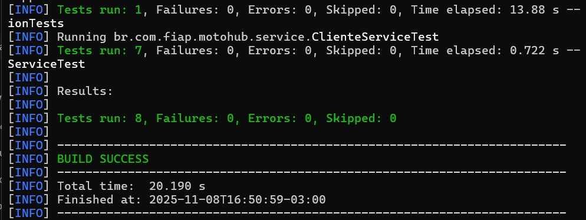
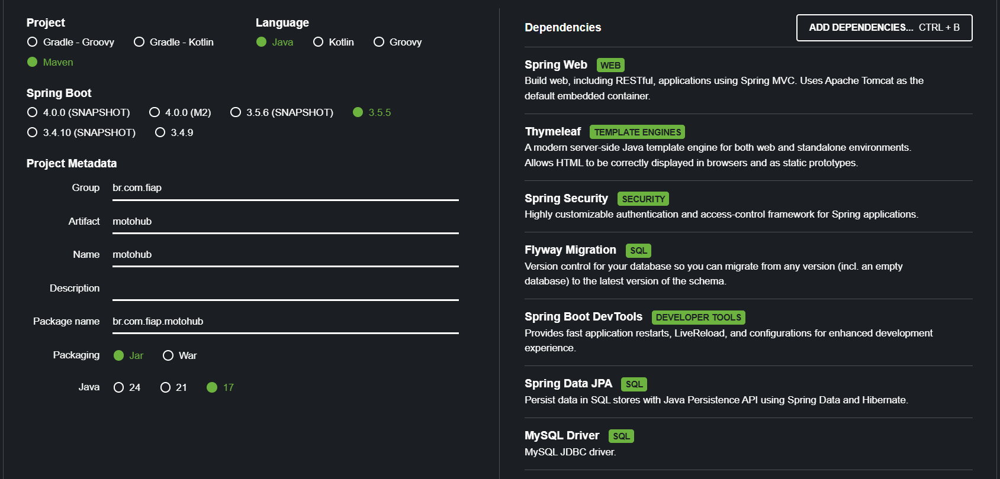

# 🏍️ MotoHub

O **MotoHub** é uma aplicação web desenvolvida como parte do **Challenge FIAP + Mottu**, com o objetivo de gerenciar dados relacionados a motos, intenções de compra e clientes.

O sistema permite realizar operações de **cadastro**, **listagem**, **atualização** e **exclusão** dessas entidades, simulando um fluxo real de gerenciamento de motos para aluguel ou venda.

---

## 👨‍💻 Integrantes

- **Caroline Assis Silva** – RM 557596  
- **Enzo de Moura Silva** – RM 556532  
- **Luis Henrique Gomes Cardoso** – RM 558883  

---

## ⚙️ Tecnologias Utilizadas

- Java 17  
- Spring Boot  
- Spring Data JPA  
- Spring Security  
- Thymeleaf  
- Flyway (migrações de banco de dados)  
- MySQL 8 (em container Docker)  
- Maven
- Azure

---

## 🌐 Acessar no navegador:

[http://localhost:8080](http://localhost:8080)

## 🐳 Banco de Dados com Docker

Para subir o banco de dados MySQL, utilizamos o Docker. O comando usado foi:

```bash
docker run --name motohub-db \
-e MYSQL_ROOT_PASSWORD=1234 \
-e MYSQL_DATABASE=motohub \
-e MYSQL_USER=motouser \
-e MYSQL_PASSWORD=1234 \
-p 3306:3306 \
-d mysql:8.0
```


## 🧪 Como Executar o Projeto

1. Clone o repositório:

```bash
git clone https://github.com/codecrazes/3.Sprint_JAVA.git
```
Subir o banco com Docker:

```bash
docker start motohub-db
```
(caso ainda não tenha criado, usar o comando completo mostrado acima)

Rodar a aplicação:
```bash
mvn spring-boot:run
```
### ✅ Usuários para Teste

#### 👑 Admin  
- **Permissões:** acesso total a todas as rotas  
- **Usuário:** `admin`  
- **Senha:** `1234`

#### 👤 Usuário Comum  
- **Permissões:** acesso às rotas de **Cliente** e **Intenções**  
- **Usuário:** `usuario`  
- **Senha:** `1234`

### ✅ Exemplo de testes endpoint

#### Clientes

- **Nome:** `Maria`  
- **Email:** `maria@email.com`
- **Telefone:** `11111111111`

#### Motos

- **Modelo:** `Fazer 250`  
- **Marca:** `Yamaha`
- **Ano:** `2023`
- **Tipo de uso:** `ALUGUEL` `VENDA`

## ✅ Como rodar os testes

```bash
mvn test
```

### ✅ Resultado esperado

Todos os testes devem passar, exibindo algo como:




## Configuração Inicial no Spring Initializr com dependências.


